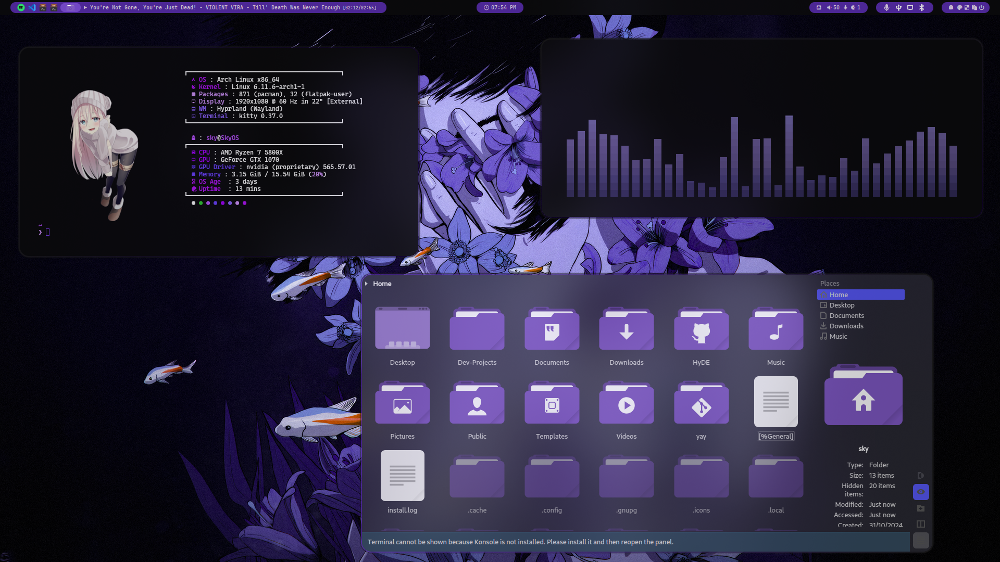
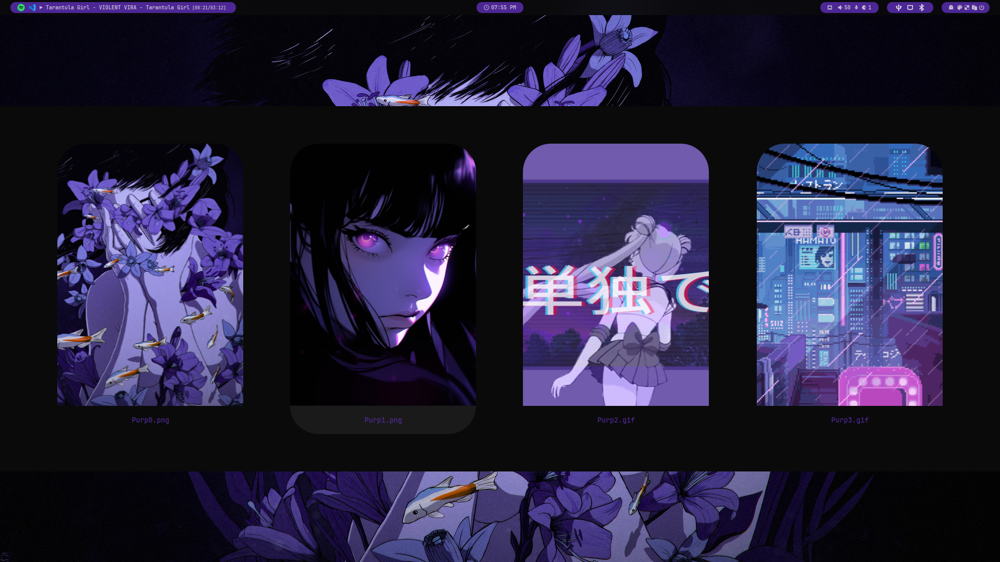
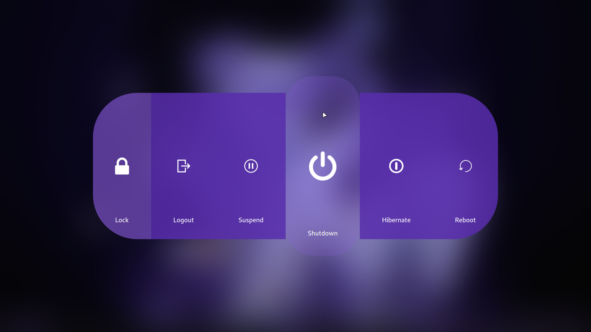

<div align = center><br><br></div>







> [!IMPORTANT]
> This is not a standalone theme, needs [Hyprdots](https://github.com/prasanthrangan/hyprdots) and [Hyde-cli](https://github.com/HyDE-Project/Hyde-cli) installed for installation...

> [!NOTE]
> Very Early Stages of Work In Progress

> [!CAUTION]
> HEHE THERE IS NOTHING 

## Installation

```sh
Hyde theme import "Purple Truth" https://github.com/SkYri3L/Purple-Truth
```

For More Themes, Check out the [HyDe Gallery](https://github.com/kRHYME7/hyde-gallery)

Inspiration For This Theme, [Scarlet Night By Abenezerw](https://github.com/abenezerw/Scarlet-Night)