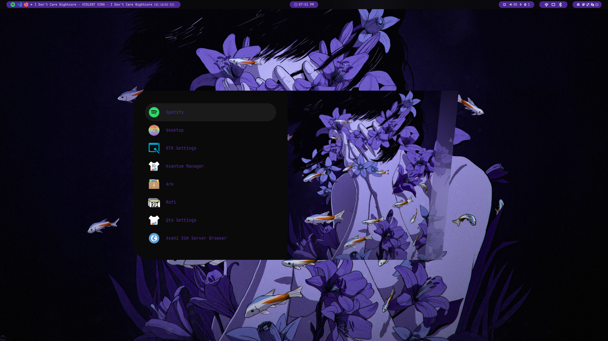

<div align = center><br><br></div>

<!--



-->
> [!IMPORTANT]
> This is not a standalone theme, needs [Hyprdots](https://github.com/prasanthrangan/hyprdots) installed...

> [!NOTE]
> Work In Progress...

> [!CAUTION]
> HEHE THERE IS NOTHING 

## Installation

```sh
Hyde theme import https://github.com/SkYri3L/Purple-Truth
```

For More Themes, Check out the [HyDe Gallery](https://github.com/kRHYME7/hyde-gallery)